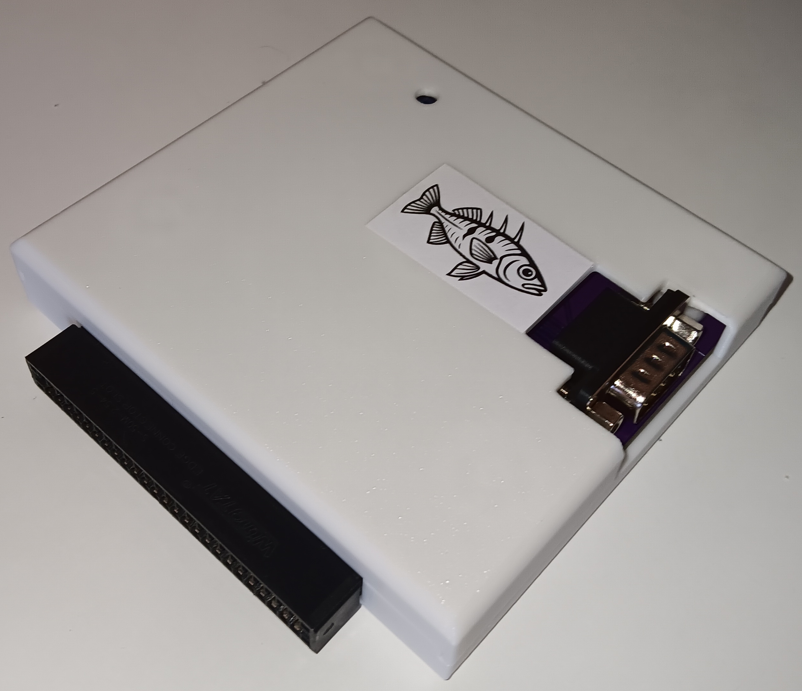
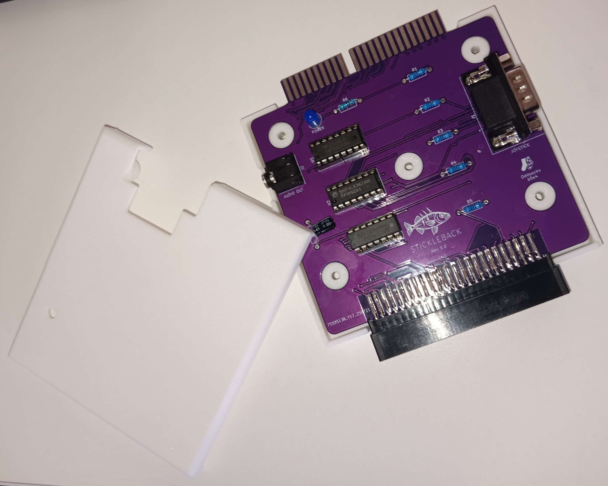

# Stickleback



## Description
A clone of the First Byte Joystick Interface with audio out and pass-through for the Acorn Electron, that connects to the rear expansion connector

**Features**
* 9-pin standard Atari-type digital joystick connector
* Compatible with the First Byte Switched Joystick Interface
  * Compatible with games that include native First Byte support
  * Compatible with most keyboard only games (via FB utility)
  * Compatible with most analogue joystick games (via FB utility)
* 3.5mm Audio Out Jack (externally amplified devices only)
* Pass-through connector
* Power LED

**Compatible Joysticks**

Any DE9 (9pin) digital joystick or joypad that uses the 'Atari' single button standard. This standard was very common on many computers and
consoles of the era and was not exclusive to Atari systems. For example joysticks which claim they are compatible with Atari Systems, C64, Amiga, VIC-20,
Kempston and others should work fine.

**Incompatible Joystick Standards**

Although these joysticks standards use the same DE9 connector, they use incompatible signalling and should not be used with the Stickleback

| Incompatible Standards |
|------------------------|
| 3D0                    |
| Interface II           |
| J-PC                   |
| MSX                    |
| SEGA                   |
| Sinclair               |
| X68000                 |


## Bill of Materials

| Qty | Component                                 |
|:---:|-------------------------------------------|
| 1   | 5mm LED                                   |
| 1   | 330Ω Axial Resistor - ¼ watt (LED)        |
| 4   | 10KΩ Axial Resistors - ¼ watt             |
| 1   | 74LS138 16pin DIP                         |
| 1   | 74LS367 16pin DIP                         |
| 1   | 74LS30 14pin DIP                          |
| 1   | 10uF Radial Electrolytic Capacitor        |
| 1   | 5-pin 3.5mm Audio Jack Socket TN/T/RN/R/S |
| 1   | Male DE-9 Connector - right angled        |
| 1   | 50pin (2x25) Edge Connector               |

* IC sockets optional
* The LED resistor is nominally 330Ω but anything up to 1K is fine
* The 3.5mm jack audio socket footprint is for a 5pin TN/T/RN/R/S connector
  * If you do not care about audio, you can omit the audio socket and the 10uF capacitor entirely.
  * As the audio is mono and no switching is enabled, TN/T/RN/R are all wired together.
  * This means should be compatible with several other 3.5mm jack socket types. 

## 3D Printable Case
A 3D printable case specifically designed for this PCB is also available. STLs are included in this repo and there is also a [Thingiverse Page](https://www.thingiverse.com/thing:7089362)

* Designed to use screws as they produce a much nicer, more robust case
* 4 x 3.5mm self-tapping screws to attach the shells. Max length about 15mm

---

## Usage
The Stickleback has several modes of operation which allow the Joystick to be used with almost every Acorn Electron game.

### Native Mode
Native mode means the game has built-in support for this joystick interface and no further setup is required. This joystick interface is referred to by several names as shown
in the table

| Name                 |
|----------------------|
| First Byte Interface |
| FB Interface         |
| FCC0 Interface       |

In cases where a game requests joystick configuration values, use these values

| Parameter  | Value |
|------------|:-----:|
| Address    | FCC0  |
| Code Type  | 1     |

Examples of games with native support

| Game           |
|----------------|
| CRACK-UP       |
| FRAK!          |
| HOSTAGES       |
| RUBBLE TROUBLE |


### Keyboard Emulation Mode
This mode is used for games that have no joystick support at all. A small software routine is installed which makes the joystick emulate
key presses. See the software section for more information.

### Analogue Emulation Mode
This mode is used for games that only support Acorn's Analogue Joystick. A small software routine is installed which makes the joystick simulate
the Acorn Analogue Joystick. See the software section for more information.

### Audio
* The Stickleback provides an audio out connecting using a 3.5mm jack socket. Any audio device connected **MUST** be externally amplified
* When an external audio device is connected, the Electron's internal speaker will still produce sound. If this is not desired you can open the case and simply disconnect the internal speaker

## Software
There are some cassette tape and disc images available in the repo which contain software utilities to support the First Byte (and consequently the Stickleback) joystick interface.

### STICKLE
Available on the disc image. Test the joystick by moving a little stickleback. Very simple, only - up, down, left, right and fire.

```
   10 REM STICKLEBACK JOYSTICK TEST
   20 MODE 5
   30 VDU 23,1,0;0;0;0
   40 CLS
   50 VDU 23,240,6,12,62,127,223,255,127,62
   60 VDU 23,241,0,0,48,96,224,192,96,48
   70 X=10:Y=10
   80 COLOUR 2
   90 PRINT "STICKLEBACK JOYSTICK"
  100 PRINT TAB(X,Y);CHR$(240)+CHR$(241)
  110 F% = 0
  120 J% = ?&FCC0 AND 32
  130 IF J% <> 32 THEN F%=1
  140 J% = 31 AND ?&FCC0
  150 IF F% = 1 THEN J% = 31 - J% 
  160 IF J% > 14 AND J% < 31 THEN PRINT TAB(X,Y);"  "
  170 IF J% = 30 AND Y > 1 THEN Y = Y - 1
  180 IF J% = 29 AND Y < 29 THEN Y = Y + 1
  190 IF J% = 27 AND X > 1 THEN X = X - 1
  200 IF J% = 23 AND X < 18  THEN X = X + 1
  210 IF J% = 15 THEN SOUND 12,12,12,12
  220 GOTO 100
```

### JOYTST
Available on the disc image. The original First Byte test program which also prints the the direction values for use in BASIC
```
   10 FLAG% = 0
   20 JOY% = ?&FCC0 AND 32
   30 IF JOY% <> 32 THEN FLAG% = 1
   40 JOY% = 31 AND ?&FCC0 
   50 IF FLAG% = 1 THEN JOY% = 31 - JOY%
   60 PRINT JOY%
   70 GOTO 40

```

### JoyGame
This is the "First Byte Joystick Interface" games menu which can be loaded from the cassette or disc image. It essentially contains a list of games which are automatically "patched" to add
support for the joystick. Choose the game and then continue to load the game from cassette or disc.

| Games Menu                 |
|----------------------------|
| SNAPPER                    |
| ARCADE                     |
| FREE FALL                  |
| STARSHIP COMMAND           |
| HOPPER                     |
| MONSTERS                   |
| METEORS                    |
| MOONRAIDER                 |
| CYBERTRON MISSION          |
| SWOOP                      |
| KILLER GORILLA             | 
| CROAKER                    |
| ESCAPE FROM MOONBASE ALPHA |
| BANDITS AT 3 O'CLOCK       |
| POSITRON                   |
| ELECTRON INVADERS          | 
| GALACTIC COMMANDER         | 
| GISBURNE'S CASTLE          | 
| MR WIZ                     |
| ALIEN DROPOUT              | 
| CHUCKIE EGG                |
| KAMIKAZE                   |
| SPACE STATION ALPHA        | 
| VORTEX                     |
| DIAMOND MINE               | 
| ALIEN BREAK IN             |
| BIRDS OF PREY              | 
| ATOM SMASHER               |
| DYNABYTE POOL              | 
| BLAGGER                    |
| BUGBLASTER                 |
| LUNAR RESCUE               |
| GUARDIAN                   |
| CITY DEFENCE               |
| GALAXY WARS                |
| PENGWYN                    |
| HUNCHBACK                  |


**Cassette Loading**
 - Insert the JoyGame cassette
 - `*TAPE`
 - `CHAIN ""`
 - Choose your game from the menu
 - Insert your game cassette
 - `CHAIN ""`

**Disc Loading**
 - Insert the JoyUtils disc
  - `*DISC`
 - `CHAIN "JOYGAME"`
 - Choose your game from the menu
 - Insert your game disc
 - `*EXEC !BOOT` (do not use SHIFT+BREAK to boot)

### JoyPch
This is the "First Byte Joystick Interface" setup menu which can be loaded from the cassette or disc image. It essentially allows you to patch any game for use with the joystick. There are two analogue routines which work
with games that support analogue joysticks. The only difference between the routines is the addresses that they sit at. The last option is for keyboard emulation. You can
define the keys that the joystick will emulate then load the game.


**Cassette Loading**
 - Insert the JoyPch cassette
 - `*TAPE`
 - `CHAIN ""`
 - Choose the routine to use
 - Insert your game cassette
 - `CHAIN ""`

**Disc Loading**
 - Insert the JoyUtils disc
 - `*DISC`
 - `CHAIN "JOYPCH"`
 - Choose the routine to use
 - Insert your game disc
 - `*EXEC !BOOT` (do not use SHIFT+BREAK to boot)

## Support Me
* [My Projects](https://projects.amiga-hardware.com) - Donate on this page
* [Order the Stickleback PCB](https://www.pcbway.com/project/shareproject/StickleBack_Acorn_Electron_Joystick_Interface_Audio_Out_49529ca6.html)
* [Order the Stickleback Case](https://www.pcbway.com/project/shareproject/StickleBack_Acorn_Electron_Joystick_Interface_Case_1205cf12.html)
